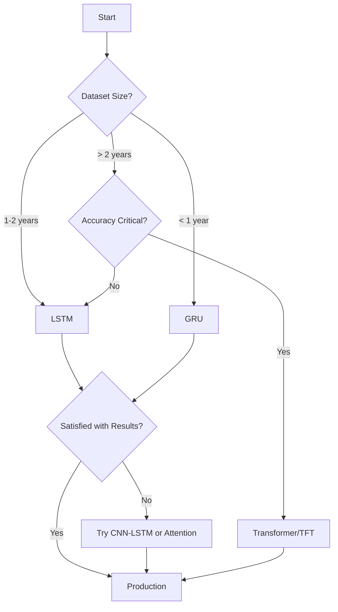

## Overview

AQI prediction is fundamentally a time series forecasting problem with multivariate inputs. This page explores the machine learning architectures supported by AQI Predictor and the rationale behind each approach.

<Info>
No single architecture is universally best. The optimal choice depends on your data characteristics, prediction horizon, computational resources, and accuracy requirements.
</Info>

## Model Types

### Recurrent Neural Networks (RNNs)

Recurrent networks are designed to process sequential data by maintaining internal state (memory) across time steps.

<Tabs>
  <Tab title="LSTM">
    **Long Short-Term Memory Networks**
    
    LSTMs are the most popular architecture for time series prediction, including AQI forecasting.
    
    **Architecture:**
    ```
    Input Sequence → LSTM Layers → Dense Layers → Output
    [t-n...t-1, t] → [Hidden States] → [Prediction] → [t+k]
    ```
    
    **Key Components:**
    - **Forget Gate:** Decides what information to discard
    - **Input Gate:** Decides what new information to store
    - **Output Gate:** Decides what to output based on cell state
    - **Cell State:** Long-term memory carrier
    
    **Advantages:**
    - Captures long-term dependencies (days, weeks)
    - Handles variable-length sequences
    - Well-suited for multiple time horizons
    - Robust to gradient vanishing problem
    
    **Best For:**
    - Medium to long-term predictions (6-48 hours)
    - When long-term patterns matter
    - Multiple pollutants with complex interactions
    
    **Typical Configuration:**
    ```python
    lookback_window: 24 hours
    lstm_units: [128, 64]
    dropout: 0.2
    prediction_horizon: 24 hours
    ```
  </Tab>
  
  <Tab title="GRU">
    **Gated Recurrent Unit**
    
    GRUs are a simpler alternative to LSTMs with fewer parameters and faster training.
    
    **Architecture:**
    ```
    Input Sequence → GRU Layers → Dense Layers → Output
    ```
    
    **Key Components:**
    - **Update Gate:** Controls how much past information to keep
    - **Reset Gate:** Controls how much past information to forget
    - No separate cell state (simpler than LSTM)
    
    **Advantages:**
    - Faster training than LSTM (30-40% fewer parameters)
    - Often comparable performance to LSTM
    - Less prone to overfitting on smaller datasets
    - Lower computational requirements
    
    **Best For:**
    - Short to medium-term predictions (1-12 hours)
    - Limited computational resources
    - Smaller datasets (< 1 year of data)
    - Quick experimentation
    
    **Typical Configuration:**
    ```python
    lookback_window: 12 hours
    gru_units: [128, 64]
    dropout: 0.2
    prediction_horizon: 12 hours
    ```
  </Tab>
  
  <Tab title="Bidirectional RNNs">
    **Bidirectional LSTMs/GRUs**
    
    Process sequences in both forward and backward directions to capture context from past and future.
    
    **Architecture:**
    ```
    Input → [Forward LSTM] → Concatenate → Dense → Output
             [Backward LSTM] ↗
    ```
    
    **Advantages:**
    - Richer representation of temporal patterns
    - Better feature extraction
    - Improved accuracy for sequence-to-sequence tasks
    
    **Trade-offs:**
    - Requires full sequence availability (not suitable for true real-time streaming)
    - Doubles computational cost
    - More complex training
    
    **Best For:**
    - Batch predictions (not real-time)
    - Post-processing or analysis of historical data
    - When you have complete sequences
  </Tab>
</Tabs>

### Transformer-Based Models

Transformers use self-attention mechanisms to capture relationships across time steps without recurrence.

<AccordionGroup>
  <Accordion title="Temporal Fusion Transformer (TFT)">
    **State-of-the-art for time series forecasting**
    
    TFT combines several advanced components:
    - **Variable Selection:** Learns which features are most relevant
    - **Static Covariates:** Incorporates time-invariant features
    - **Multi-Horizon:** Predicts multiple time steps simultaneously
    - **Attention:** Interprets which past time steps influence predictions
    
    **Architecture Highlights:**
    ```
    Static Features ────┐
    Historical Inputs ──┼─→ Variable Selection → LSTM Encoder → 
    Known Future Inputs─┘                                         
                                              → Multi-Head Attention →
                                              → Gated Residual Network →
                                              → Output Layer
    ```
    
    **Advantages:**
    - Superior accuracy on complex datasets
    - Interpretable attention weights
    - Handles multiple types of inputs naturally
    - Built-in uncertainty quantification
    
    **Requirements:**
    - Large datasets (2+ years recommended)
    - More computational resources
    - Longer training time
    - Hyperparameter tuning is critical
    
    **Best For:**
    - Production systems with high accuracy needs
    - When interpretability matters
    - Multi-step ahead predictions
    - Rich feature sets with multiple data types
  </Accordion>
  
  <Accordion title="Standard Transformer">
    **Attention-based sequence modeling**
    
    Pure transformer architecture adapted for time series.
    
    **Key Mechanisms:**
    - **Self-Attention:** Captures relationships between all time steps
    - **Positional Encoding:** Injects temporal order information
    - **Multi-Head Attention:** Multiple attention patterns
    
    **Advantages:**
    - Parallelizable (faster training than RNNs)
    - No vanishing gradient problems
    - Can capture long-range dependencies
    
    **Challenges:**
    - Requires more data than RNNs
    - Can overfit on smaller datasets
    - Less inductive bias for temporal structure
    
    **Best For:**
    - Very large datasets
    - When training time matters
    - Long sequences (> 48 hours lookback)
  </Accordion>
</AccordionGroup>

### Hybrid Architectures

Combining multiple architectural components often yields best results.

<CardGroup cols={2}>
  <Card title="CNN-LSTM" icon="layer-group">
    **Convolutional layers extract local patterns, LSTM captures temporal dependencies**
    
    ```
    Input → 1D CNN → LSTM → Dense → Output
    ```
    
    **Use Case:**
    - Extract local temporal patterns (hourly cycles)
    - Good for multi-sensor or spatial data
    - Reduces sequence length for LSTM
  </Card>
  
  <Card title="Encoder-Decoder" icon="arrows-left-right">
    **Separate encoding and decoding phases**
    
    ```
    Encoder: Input Sequence → Context Vector
    Decoder: Context → Multi-step Output
    ```
    
    **Use Case:**
    - Multi-step ahead prediction
    - Sequence-to-sequence mapping
    - When output length differs from input
  </Card>
  
  <Card title="Attention + LSTM" icon="eye">
    **LSTM with attention mechanism**
    
    Attention layer helps model focus on most relevant past time steps.
    
    **Use Case:**
    - Improved accuracy over plain LSTM
    - Interpretable predictions
    - Long sequences
  </Card>
  
  <Card title="Ensemble Models" icon="people-group">
    **Combine predictions from multiple models**
    
    Average or weighted combination of LSTM, GRU, Transformer outputs.
    
    **Use Case:**
    - Maximum accuracy
    - Reduce model variance
    - Production systems
  </Card>
</CardGroup>

## Training Considerations

### Input/Output Configuration

<Tabs>
  <Tab title="Univariate vs Multivariate">
    **Univariate Prediction**
    ```
    Input: PM2.5[t-24:t]
    Output: PM2.5[t+1]
    ```
    - Predict one pollutant based on its history
    - Simpler, faster training
    - Limited by single variable view
    
    **Multivariate Prediction**
    ```
    Input: [PM2.5, PM10, NO2, O3, temp, wind, ...][t-24:t]
    Output: PM2.5[t+1]
    ```
    - Use multiple variables to predict target
    - Captures cross-pollutant relationships
    - Better accuracy but more complex
    - **Recommended approach**
  </Tab>
  
  <Tab title="Single-step vs Multi-step">
    **Single-step**
    ```
    Output: AQI[t+1]
    ```
    - Predict one time step ahead
    - Can be chained (use prediction as input for next step)
    - Error accumulates in chaining
    
    **Multi-step Direct**
    ```
    Output: [AQI[t+1], AQI[t+2], ..., AQI[t+24]]
    ```
    - Predict multiple time steps simultaneously
    - No error accumulation
    - More complex output layer
    - **Recommended for horizons > 3 hours**
    
    **Multi-step Recursive**
    ```
    Output: AQI[t+1]
    Feed output back as input → AQI[t+2]
    ...
    ```
    - Chain single-step predictions
    - Simpler model
    - Compounds prediction errors
  </Tab>
  
  <Tab title="Point vs Probabilistic">
    **Point Prediction**
    ```
    Output: AQI = 87.3
    ```
    - Single value prediction
    - Standard approach
    - No uncertainty information
    
    **Probabilistic Prediction**
    ```
    Output: AQI ~ N(87.3, σ=12.5)
    or: P10=72, P50=87, P90=103
    ```
    - Provides prediction intervals
    - Quantifies uncertainty
    - Better for decision-making
    - Requires different loss functions (quantile loss, negative log-likelihood)
    - **Recommended for production systems**
  </Tab>
</Tabs>

### Loss Functions

<AccordionGroup>
  <Accordion title="Mean Squared Error (MSE)">
    **Standard regression loss**
    
    ```python
    MSE = (1/n) Σ(y_true - y_pred)²
    ```
    
    **Characteristics:**
    - Penalizes large errors heavily (quadratic)
    - Sensitive to outliers
    - Most common choice
    
    **Use when:** Outliers are truly errors and should be heavily penalized
  </Accordion>
  
  <Accordion title="Mean Absolute Error (MAE)">
    **Robust to outliers**
    
    ```python
    MAE = (1/n) Σ|y_true - y_pred|
    ```
    
    **Characteristics:**
    - Linear penalty
    - More robust to outliers
    - All errors weighted equally
    
    **Use when:** Dataset has many outliers or measurement noise
  </Accordion>
  
  <Accordion title="Huber Loss">
    **Hybrid MSE/MAE**
    
    ```python
    Huber = MSE for small errors, MAE for large errors
    ```
    
    **Characteristics:**
    - Best of both worlds
    - Robust but still sensitive to large errors
    - Requires delta parameter tuning
    
    **Use when:** Want balance between MSE and MAE
  </Accordion>
  
  <Accordion title="Quantile Loss">
    **For probabilistic predictions**
    
    ```python
    QuantileLoss(τ) = max(τ(y - ŷ), (τ-1)(y - ŷ))
    ```
    
    **Characteristics:**
    - Predicts specific quantiles (e.g., P10, P50, P90)
    - Asymmetric penalty
    - Produces prediction intervals
    
    **Use when:** Need uncertainty quantification or risk-based decisions
  </Accordion>
</AccordionGroup>

### Regularization Techniques

<CardGroup cols={2}>
  <Card title="Dropout" icon="toggle-off">
    Randomly deactivate neurons during training to prevent co-adaptation.
    
    **Typical rates:** 0.2-0.5
    
    **Apply to:** Dense layers, recurrent connections
  </Card>
  
  <Card title="Recurrent Dropout" icon="repeat">
    Dropout applied to recurrent connections in LSTM/GRU.
    
    **Typical rates:** 0.1-0.3
    
    **Careful:** Too high degrades temporal learning
  </Card>
  
  <Card title="L1/L2 Regularization" icon="weight-scale">
    Penalize large weights in loss function.
    
    **L2 (Ridge):** Smooth weight decay
    **L1 (Lasso):** Sparse weights
    
    **Typical values:** 1e-5 to 1e-3
  </Card>
  
  <Card title="Early Stopping" icon="stop">
    Stop training when validation loss stops improving.
    
    **Patience:** 10-20 epochs
    
    **Most effective regularization technique**
  </Card>
</CardGroup>

## Model Evaluation

### Metrics

<Info>
Use multiple metrics to get a complete picture of model performance. Different metrics emphasize different aspects.
</Info>

| Metric | Formula | Interpretation | Use Case |
|--------|---------|----------------|----------|
| **RMSE** | √(MSE) | Same units as target | Overall accuracy, penalizes large errors |
| **MAE** | Mean(\|y - ŷ\|) | Same units, robust to outliers | Typical prediction error |
| **MAPE** | Mean(\|y - ŷ\|/y) × 100 | Percentage error | Relative accuracy across scales |
| **R²** | 1 - (SS_res/SS_tot) | Variance explained (0-1) | Model quality vs baseline |
| **IA** | Index of Agreement | 0-1, how well model matches observations | Overall performance |

### Validation Strategy

<Tabs>
  <Tab title="Time Series Split">
    **Forward-chaining validation**
    
    ```
    Train: [────────────────] (2020-2022)
    Valid: [────] (2023 Q1)
    Test:  [────] (2023 Q2)
    ```
    
    - Respect temporal order (no future data in training)
    - Split chronologically
    - **Always use this for time series**
    
    **Never use random K-fold for time series!**
  </Tab>
  
  <Tab title="Walk-Forward Validation">
    **Simulate production deployment**
    
    ```
    Fold 1: Train[Year 1] → Test[Month 13]
    Fold 2: Train[Year 1-2] → Test[Month 25]
    Fold 3: Train[Year 1-3] → Test[Month 37]
    ```
    
    - More robust evaluation
    - Tests multiple time periods
    - Higher computational cost
    - **Recommended for final evaluation**
  </Tab>
  
  <Tab title="Holdout Test Set">
    **Final unseen evaluation**
    
    Reserve most recent 3-6 months completely untouched during development.
    
    - Use only once for final evaluation
    - Report these as your official results
    - Prevents overfitting to validation set
  </Tab>
</Tabs>

## Architecture Selection Guide

<Note>
Start simple, add complexity only if needed. An LSTM or GRU is sufficient for most AQI prediction tasks.
</Note>



### Quick Recommendations

| Scenario | Recommended Architecture | Lookback | Horizon |
|----------|--------------------------|----------|----------|
| Quick prototype | GRU (64 units) | 12h | 6h |
| Standard production | LSTM (128, 64 units) | 24h | 24h |
| High-accuracy system | TFT or Ensemble | 48h | 48h |
| Limited compute | GRU (single layer) | 6h | 3h |
| Research / state-of-art | Transformer + Attention | 72h | 72h |

<Note>
**Next Steps:** With this understanding of architectures, you're ready to explore the [Quick Start Guide](/quickstart) to begin training your first model.
</Note>
