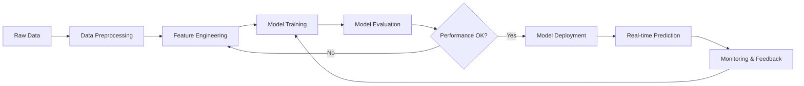

## What is Air Quality Index (AQI)?

The Air Quality Index (AQI) is a standardized indicator used worldwide to communicate how polluted the air currently is or how polluted it is forecast to become. AQI values range from 0 to 500, where higher values indicate greater levels of air pollution and greater health concerns.

<CardGroup cols={2}>
  <Card title="Good (0-50)" icon="face-smile" color="#00e400">
    Air quality is satisfactory, and air pollution poses little or no risk.
  </Card>
  <Card title="Moderate (51-100)" icon="face-meh" color="#ffff00">
    Air quality is acceptable. However, there may be a risk for some people, particularly those who are unusually sensitive to air pollution.
  </Card>
  <Card title="Unhealthy for Sensitive Groups (101-150)" icon="face-frown" color="#ff7e00">
    Members of sensitive groups may experience health effects. The general public is less likely to be affected.
  </Card>
  <Card title="Unhealthy (151-200)" icon="triangle-exclamation" color="#ff0000">
    Some members of the general public may experience health effects; members of sensitive groups may experience more serious health effects.
  </Card>
  <Card title="Very Unhealthy (201-300)" icon="circle-exclamation" color="#8f3f97">
    Health alert: The risk of health effects is increased for everyone.
  </Card>
  <Card title="Hazardous (301-500)" icon="skull" color="#7e0023">
    Health warning of emergency conditions: everyone is more likely to be affected.
  </Card>
</CardGroup>

## Why Machine Learning for AQI Prediction?

Predicting AQI values is a complex challenge that requires analyzing multiple interrelated factors:

<AccordionGroup>
  <Accordion title="Multiple Pollutant Interactions">
    AQI is determined by multiple pollutants (PM2.5, PM10, NO2, O3, SO2, CO) that interact in complex, non-linear ways. Machine learning models can capture these intricate relationships better than traditional statistical methods.
  </Accordion>

  <Accordion title="Temporal Dependencies">
    Air quality has strong temporal patterns - hourly cycles, daily rhythms, weekly trends, and seasonal variations. ML models, especially sequential architectures, excel at learning these time-based dependencies.
  </Accordion>

  <Accordion title="Spatial Correlations">
    Pollution spreads and transforms across geographic regions. Advanced models can incorporate spatial relationships between monitoring stations and environmental features.
  </Accordion>

  <Accordion title="Meteorological Influences">
    Weather conditions (wind, temperature, humidity, pressure) dramatically affect pollutant dispersion and formation. ML models can learn complex meteorological impacts automatically from data.
  </Accordion>
</AccordionGroup>

## The AQI Predictor Approach

AQI Predictor is designed as a flexible, scalable system for training and deploying machine learning models that forecast AQI values hours to days in advance.

### Core Principles

<CardGroup cols={2}>
  <Card title="Data-Driven" icon="database">
    Learn patterns directly from historical air quality and environmental data rather than relying solely on physical models.
  </Card>
  <Card title="Multivariate" icon="chart-line">
    Incorporate multiple pollutants, meteorological variables, and temporal features simultaneously.
  </Card>
  <Card title="Flexible Architecture" icon="cubes">
    Support multiple model types (LSTM, GRU, Transformer, CNN-LSTM hybrids) to find the best fit for your data.
  </Card>
  <Card title="Production-Ready" icon="rocket">
    Built with deployment in mind, featuring model versioning, monitoring, and scalable inference.
  </Card>
</CardGroup>

### Prediction Workflow

## Key Terminology

<Info>
Familiarize yourself with these terms as they appear throughout the documentation.
</Info>

| Term | Definition |
|------|------------|
| **Pollutant** | A substance in the air that can be harmful to health or the environment |
| **PM2.5** | Particulate Matter with diameter < 2.5 micrometers |
| **PM10** | Particulate Matter with diameter < 10 micrometers |
| **Time Horizon** | How far into the future the model predicts (e.g., 1-hour, 24-hour) |
| **Lookback Window** | Amount of historical data used as input (e.g., past 24 hours) |
| **Feature Vector** | Numerical representation of all input variables at a given time |
| **Sequence Model** | ML model designed to process temporal sequences (LSTM, GRU, Transformer) |
| **Inference** | Using a trained model to make predictions on new data |

## Understanding the Challenge

<Tabs>
  <Tab title="Short-term Prediction">
    **Time Horizon:** 1-6 hours ahead
    
    Short-term predictions rely heavily on recent pollutant concentrations and immediate meteorological conditions. These are generally more accurate as the air quality state has high autocorrelation over short periods.
    
    **Key Factors:**
    - Recent pollutant trends
    - Current wind patterns
    - Local emission sources
    - Temperature and humidity
  </Tab>
  
  <Tab title="Medium-term Prediction">
    **Time Horizon:** 12-48 hours ahead
    
    Medium-term forecasts require understanding daily cycles, weather system movements, and emission patterns. Accuracy decreases as the prediction window extends, but models can still provide valuable warnings.
    
    **Key Factors:**
    - Diurnal patterns
    - Weather forecast data
    - Day-of-week emission patterns
    - Seasonal trends
  </Tab>
  
  <Tab title="Long-term Prediction">
    **Time Horizon:** 3-7 days ahead
    
    Long-term predictions are more challenging and rely on meteorological forecasts, seasonal patterns, and larger-scale atmospheric conditions. These are useful for public health planning.
    
    **Key Factors:**
    - Extended weather forecasts
    - Seasonal patterns
    - Large-scale climate patterns
    - Historical trend analysis
  </Tab>
</Tabs>

<Note>
**Next Steps:** Explore [Data Sources](/concepts/data-sources) to understand what data you need, or dive into [Model Architecture](/concepts/model-architecture) to learn about the ML approaches available.
</Note>
